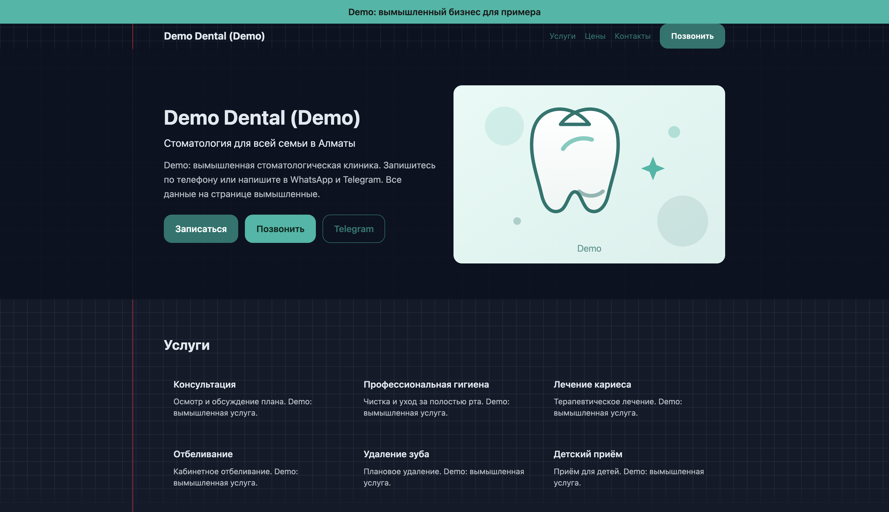

# astro-local-landing

[](https://github.com/Godsdar/astro-local-landing/actions/workflows/check.yml)

A small static landing starter for a local business. Astro, TypeScript, Tailwind and Vitest. One config file, no backend, no external fonts.

This repository ships with an invented **Demo** business. Replace all of it before showing a client. No real clients, prices, reviews or photos are included.

## Live demo

Non-commercial portfolio demo on GitHub Pages: https://godsdar.github.io/astro-local-landing/

The demo business is invented and the build is `noindex`.



## What is inside

- `site.config.ts`: the only file you edit per client (name, description, services, optional prices, hours, address, phone, messengers, map link, colors, language `ru`).
- Sections: hero, services, optional pricing, how we work, FAQ, reviews (sample block when empty), map, contacts, footer.
- Contact without a backend: phone, WhatsApp, Telegram links and a sticky call button on mobile. No form.
- SEO: title, description, Open Graph, sitemap, robots.txt, JSON-LD LocalBusiness (geo, hours), favicon, manifest.
- Themes: `calm`, `bold`, `warm` (one line), plus dark mode by `prefers-color-scheme`.
- Map: OpenStreetMap loads only after a click; an own SVG image shows before that.
- Background: a notebook grid drawn with CSS gradients. See "Background" below.
- Illustrations: an own SVG hero image and map image (no stock photos, no third-party assets).
- Speed: system fonts, no external scripts, own SVG images only.

## Background

The page uses a light checkerboard, drawn with a CSS `conic-gradient` (no image). Cells alternate between dark blue and green:

```ts
background: { style: "grid", size: 24, margin: true }
```

- `size` is the cell size in px (`--grid-size`); cells are shown at `2 x size` so the two colors alternate.
- Cell colors: `--cell-a` (dark blue) and `--cell-b` (green); lighter variants in dark mode.
- `margin: true` adds a soft red margin line on wide screens.
- `style: "plain"` turns the checkerboard off.

The pattern covers the whole page, softens under `prefers-contrast: more` and `prefers-reduced-transparency`, and is hidden in print.

## Reviews

The demo has no real reviews. It shows a sample block. To use real reviews, put them in `site.config.ts`:

```ts
testimonials: [{ name: "Client name", text: "Real review text" }]
```

The sample block is replaced by the real list. Do not invent reviews.

## Turn it into a client site in 1 to 2 days (estimate)

1. Copy this folder into a new project directory. Run `git init` (local only).
2. Fill `site.config.ts`: business name, description, services, hours, address, phone, WhatsApp/Telegram, map link, colors. Turn `demo` off only for a real client.
3. Replace `public/images/*.svg` with the client's own images (keep them light). Replace `public/favicon.svg` with the client logo, or keep a clean icon.
4. Set `siteUrl` in `site.config.ts` to the client domain, and update `public/robots.txt` sitemap URL to the same domain.
5. Check the content against the client's materials and the intake file `~/job-search/templates/client-intake.md`.
6. Run `npm install` then `npm run check`. Fix anything red.
7. Run `npm run preview` and check the page on a narrow screen and a wide screen.
8. Deploy to the client account (Cloudflare Pages or Netlify). See `deploy/`. The client owns the account and the domain.

## Check before handover

- All text, services, address, hours and contacts come from the client.
- Contact links work: phone, WhatsApp, Telegram, map.
- Mobile layout is fine at about 360 px wide.
- Page budget: run `npm run check`, it fails if HTML + CSS + JS go over 150 KB.
- SEO tags present: title, description, Open Graph, sitemap, robots.txt, JSON-LD, favicon.
- Handover checklist: `~/job-search/templates/acceptance-handoff.md`.

## What I tested

- `npm run check` runs ESLint, `astro check`, Vitest, `astro build`, a page-size check and a placeholder check.
- Tests: 13 Vitest cases for `site.config` (required fields, theme, map, FAQ, phone and link format) and the contact link helpers.
- Build: static output in `dist/`, 3 pages (`/`, `/privacy/`, `/404.html`).
- Page budget: HTML + CSS + JS was 39.3 KB against a 150 KB limit.
- Placeholders: the built HTML has no TODO, lorem, placeholder or XXX tokens.
- GitHub Actions runs the same steps on each push.

## Docs

- `docs/config-reference.md`: every field in `site.config.ts`.
- `docs/launch-checklist.md`: accounts, DNS, hosting notes, post-launch checks.
- `docs/design-notes.md`: design decisions.

## Commands

- `npm run dev`: local dev server.
- `npm run check`: lint, `astro check`, tests, build, size budget. This is the gate.
- `npm run build`: production build into `dist/`.
- `npm run preview`: preview the built site.

## Later: use as a public portfolio demo

This starter can become a public demo project for a portfolio. Keep the **Demo** label, keep the invented business, and add no client data. Then link it from the portfolio README as a live demo, not as client work.
